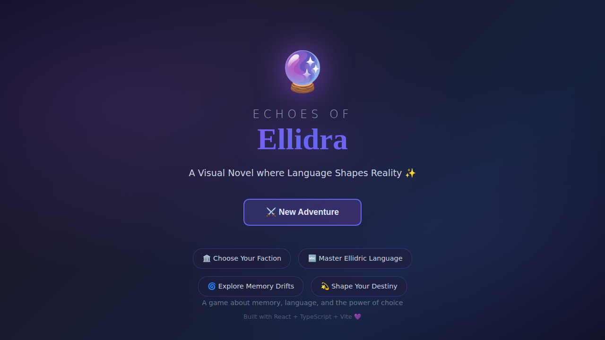

# 🔮 Echoes of Ellidra ✨

> **A visual novel where language shapes reality!** Wake up in the frost-bound realm of Valdaren with no memory, discover you're the legendary First Speaker, and choose your destiny among warring factions! 🎮💜

  

## 📸 Demo



## 🎮 Play Now!

```bash
cd game
npm install    # Install dependencies (~10 seconds) 📦
npm run dev    # Start dev server 🚀
# Visit http://localhost:5173 and begin your journey! ✨
```

## 🌟 Features

- **🏛️ Faction System** - Choose between the Institute, the Clans, or walk your own path
- **🔤 Ellidric Language** - Master the mystical tongue that reshapes reality
- **💬 Branching Dialogue** - Your choices have real consequences
- **🌀 Memory Drift** - Explore unstable zones where memories blur
- **💾 Auto-Save** - Never lose your progress
- **✨ Beautiful UI** - Smooth animations and mystical atmosphere

## 📖 The Story

You wake in the frost-wrapped realm of **Valdaren** with no memory. Ancient **Ellidric** glyphs respond to your touch like they know you're the main character. Three factions war over control of this mystical language:

- **🏛️ Institute of Lingua Arcanum** - They want to codify and control Ellidric
- **🌲 Clans of the Whispering Woods** - They believe language must be wild and free  
- **👻 The Echoborn** - Mysterious beings who claim to BE the language itself

Your choices will reshape Valdaren itself. What kind of First Speaker will you become?

## 📜 Lore Summary

### 🌍 The World
**Valdaren** is a frost-bound realm where **language literally shapes reality**. Snow-choked forests, crystal lakes, and ancient ruins are etched with *Ellidric* glyphs that hum with latent power.

### 🔮 The Magic System: Ellidric
An ancient constructed language with **four mystical layers**:
| Layer | What It Does |
|-------|--------------|
| 🎵 **Sound** | How it's spoken |
| 💜 **Emotion** | Feeling it carries |
| 🧠 **Mnemonic** | Memory it links to |
| ⚖️ **Ethics** | Moral weight & consequences |

Speaking Ellidric can unlock buried memories, alter perception of reality, or even change someone's identity! No single language fully translates it—English, Dutch, Latin, and Greek each reveal different facets.

### ⚔️ The Conflict
Three factions war over control of this powerful language:

| Faction | Philosophy | Vibe |
|---------|------------|------|
| 🏛️ **Institute of Lingua Arcanum** | "Order through Words" - Codify & control Ellidric | Academic, powerful |
| 🌲 **Clans of the Whispering Woods** | "The Word Breathes" - Keep Ellidric wild & free | Natural, spiritual |
| 🔮 **The Echoborn** | "We Are the Echo" - They claim to BE the language | Mysterious, ancient |

### 🌟 Your Journey
You wake with no memories. Ancient glyphs respond to your touch—a power not seen since the legendary **First Speaker**. Your choices will determine whether Ellidric is controlled, kept wild, or something else entirely...

> 📚 *Deep dive into the full lore at [`world_data/`](./world_data) — history, characters, factions & more!*

## 🛠️ Development

```bash
# Build for production
npm run build

# Run linter
npm run lint

# Preview production build
npm run preview
```

## 🐳 Docker Deployment

```bash
# Build and run production container
docker compose build web
docker compose up web
# Visit http://localhost:3000

# Development with hot reload
docker compose --profile dev up web-dev
```

## 🌐 Deploy

- **Vercel**: Automatic via `vercel.json`
- **Netlify**: Configure via `netlify.toml`
- **Docker**: Use `docker-compose.yml`

## 📁 Project Structure

```
game/                    # Main game application
├── src/
│   ├── components/     # Vue UI components
│   ├── composables/    # Vue composables (state)
│   ├── data/          # Story and game data
│   └── types/         # TypeScript definitions
├── public/            # Static assets
└── dist/              # Production build

world_data/            # Game lore and world building
├── lore.md           # World history and Ellidric language
├── characters.md     # Character profiles
├── factions.md       # Faction details
└── mechanics.md      # Game systems

docs/                  # Deployment tutorials
Ellidric/             # Language reference
```

## 🎭 Tech Stack

- **🌿 Vue.js 3** - UI framework with Composition API
- **⚡ Vite 5** - Lightning-fast builds
- **📘 TypeScript** - Type safety
- **🎨 CSS** - Beautiful styling

## 📚 Lore Resources

Check out the `world_data/` directory for deep dives into:
- The history of Valdaren
- Ellidric language mechanics
- Faction philosophies
- Character backgrounds

---

**✨ May your choices reshape Valdaren! ✨**

*Built with 💜 by storytellers who believe games can be literature*
